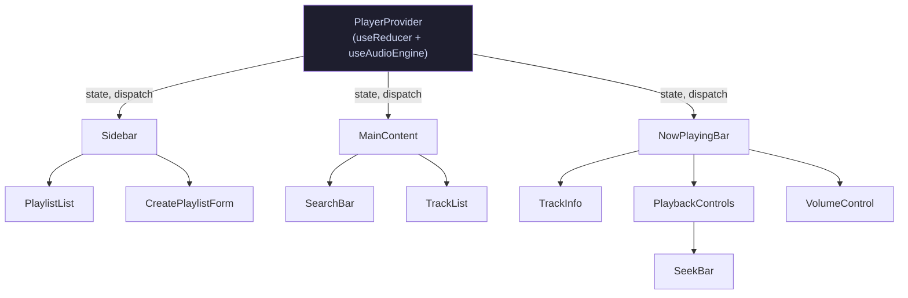

# Design Document: EchoBox Music

## Overview

EchoBox Music is a single-page React application that plays a small, curated set of local audio files (MP3 and WAV) directly in the browser using the HTML5 Audio API. There is no backend, no authentication, and no external services. All persistent user data (playlists and volume level) lives in `localStorage`.

The application is built with:
- **React** (functional components + hooks) for the UI layer
- **Vite** for bundling and local development
- **Plain CSS** for styling (no frameworks)
- **HTML5 `<audio>` element** (via the `HTMLAudioElement` API) for playback
- **`localStorage`** for persisting playlists and volume

There is no routing — the app is a single view. All state flows downward from a central context provider.

---

## Architecture

### High-level overview

```
App
└── PlayerProvider  (React Context — global player state)
    ├── Sidebar
    │   ├── PlaylistList
    │   │   └── PlaylistItem
    │   └── CreatePlaylistForm
    ├── MainContent
    │   ├── SearchBar
    │   └── TrackList
    │       └── TrackItem
    └── NowPlayingBar
        ├── TrackInfo
        ├── PlaybackControls
        │   └── SeekBar
        └── VolumeControl
```

All components below `PlayerProvider` consume player state via `useContext`. UI components that need to dispatch actions import and call the dispatch function from the same context.

### State management

A single `PlayerProvider` wraps the entire app. It holds all global state in a `useReducer` and exposes:
- `state` — the current player state (see Data Models)
- `dispatch` — the reducer dispatch function
- The audio engine imperative methods (play, pause, seek, setVolume, loadTrack)

The `useAudioEngine` hook is instantiated once inside `PlayerProvider`. It owns the `HTMLAudioElement` ref and bridges audio events into reducer dispatch calls.

Local state (form inputs, hover states, confirmation dialogs) remains in individual components with `useState`.

### Mermaid: Component and state flow



---

## Components and Interfaces

### `PlayerProvider`

Instantiates `useAudioEngine` and `usePlaylistManager`. Wraps children in `PlayerContext.Provider`.

**Props:** `{ children }`

**Context value shape:**
```js
{
  state,          // PlayerState (see Data Models)
  dispatch,       // React dispatch
  audioEngine,    // { play, pause, seek, setVolume, loadTrack, skipNext, skipPrevious }
  playlists,      // Playlist[]
  playlistActions // { create, rename, delete, addTrack, removeTrack }
}
```

---

### `Sidebar`

Renders the playlist panel on the left side. Contains `PlaylistList` and `CreatePlaylistForm`.

---

### `PlaylistList`

Iterates over `playlists` from context. Renders a `PlaylistItem` for each. Handles play-playlist and delete-playlist triggers.

---

### `PlaylistItem`

Displays playlist name, track count, play button, and delete button. Emits play and delete callbacks up to `PlaylistList`.

**Props:** `{ playlist, onPlay, onDelete, isActive }`

---

### `CreatePlaylistForm`

Controlled input for new playlist name. Calls `playlistActions.create(name)` on submit. Displays validation/duplicate errors inline.

---

### `SearchBar`

Controlled input bound to local `searchQuery` state. Passes query up to `MainContent` or stores it in a shared local state within `MainContent`.

---

### `TrackList`

Receives the filtered list of tracks (derived from `catalog` + `searchQuery`). Renders `TrackItem` for each. Shows "No results found" or "No tracks available" when appropriate.

**Props:** `{ tracks, onTrackSelect }`

---

### `TrackItem`

Displays track title, artist, and formatted duration. Highlights when `track.id` matches `state.currentTrack?.id`. Calls `onTrackSelect(track)` on click.

**Props:** `{ track, isActive }`

---

### `NowPlayingBar`

Fixed bottom bar. Composed of `TrackInfo`, `PlaybackControls`, and `VolumeControl`. Reads from player context for all display values.

---

### `TrackInfo`

Displays `state.currentTrack?.title` and `state.currentTrack?.artist`, or placeholder text when no track is loaded. Applies CSS `text-overflow: ellipsis`.

---

### `PlaybackControls`

Contains previous, play/pause, and next buttons plus `SeekBar`. Dispatches `audioEngine.play/pause/skipNext/skipPrevious`.

Disables play/pause button while `state.status === 'loading'`. Shows a spinner/loading indicator in that state.

---

### `SeekBar`

Range input bound to `state.currentTime`. On user interaction (mouse drag, click) calls `audioEngine.seek(value)`. Updates in real time via `state.currentTime` from `timeupdate` events. Non-interactive when `state.currentTrack === null`.

---

### `VolumeControl`

Range input (`min=0 max=1 step=0.01`) bound to `state.volume`. Calls `audioEngine.setVolume(value)` on change.

---

## Data Models

### Track

The atomic unit of content. Defined in the static catalog.

```js
/**
 * @typedef {Object} Track
 * @property {string} id      - Unique identifier (e.g. slug derived from filename)
 * @property {string} title   - Display title
 * @property {string} artist  - Artist name
 * @property {string} album   - Album name (optional, may be empty)
 * @property {number} duration - Total duration in seconds
 * @property {string} src     - Path to the audio file relative to /public (e.g. "/audio/track01.mp3")
 */
```

### Playlist

User-created, persisted to `localStorage`.

```js
/**
 * @typedef {Object} Playlist
 * @property {string}  id      - Unique identifier (UUID or nanoid)
 * @property {string}  name    - User-provided name
 * @property {Track[]} tracks  - Ordered list of tracks
 */
```

### Queue

Transient — never persisted. Lives in player state only.

```js
/**
 * @typedef {Object} Queue
 * @property {Track[]} tracks       - Ordered tracks in the current queue
 * @property {number}  currentIndex - Index of the currently active track (-1 if none)
 * @property {string|null} sourceId - ID of the playlist that populated the queue, or null for catalog
 */
```

### PlayerState

The full shape of the reducer state.

```js
/**
 * @typedef {'idle'|'loading'|'playing'|'paused'|'error'} PlaybackStatus
 *
 * @typedef {Object} PlayerState
 * @property {Track|null}     currentTrack  - The active track object, or null
 * @property {PlaybackStatus} status        - Current playback status
 * @property {number}         currentTime   - Playback position in seconds
 * @property {number}         duration      - Total duration of current track in seconds
 * @property {number}         volume        - Volume level [0, 1]
 * @property {Queue}          queue         - The current queue
 * @property {string|null}    error         - Current error message, or null
 */
```

### Initial state

```js
const initialState = {
  currentTrack: null,
  status: 'idle',
  currentTime: 0,
  duration: 0,
  volume: 1,
  queue: { tracks: [], currentIndex: -1, sourceId: null },
  error: null,
};
```

### Reducer actions

```js
// Action types
'LOAD_TRACK'          // { track, queue? }
'PLAY'
'PAUSE'
'SEEK'                // { time }
'TIME_UPDATE'         // { currentTime }
'TRACK_LOADED'        // { duration }
'TRACK_ENDED'
'SET_VOLUME'          // { volume }
'SET_ERROR'           // { error }
'CLEAR_ERROR'
'SET_STATUS'          // { status }
'QUEUE_EXHAUSTED'
```

---

### Track Catalog

The catalog is defined in a plain JavaScript module at `src/data/catalog.js`:

```js
// src/data/catalog.js
export const CATALOG = [
  {
    id: 'track-01',
    title: 'Example Track 1',
    artist: 'Artist A',
    album: 'Album One',
    duration: 213,          // seconds, must match actual file
    src: '/audio/track01.mp3',
  },
  // ... more tracks
];
```

The catalog is imported at the top level of `App.jsx` and passed into the provider. Adding new tracks means adding an entry to this file and dropping the audio file into `public/audio/`.

---

### localStorage Schema

Two keys are used, both namespaced to avoid collisions:

| Key | Type | Purpose |
|-----|------|---------|
| `echobox:playlists` | `string` (JSON) | Array of `Playlist` objects |
| `echobox:volume` | `string` (JSON) | Volume level, a number in `[0, 1]` |

**Playlists JSON shape:**
```json
[
  {
    "id": "pl-abc123",
    "name": "Chill Mix",
    "tracks": [
      {
        "id": "track-01",
        "title": "Example Track 1",
        "artist": "Artist A",
        "album": "Album One",
        "duration": 213,
        "src": "/audio/track01.mp3"
      }
    ]
  }
]
```

Tracks are stored inline within playlists (denormalized) so that playlist data is self-contained and survives catalog changes.

---

## Audio Engine Design

### `useAudioEngine` hook

The audio engine is a custom hook that owns a single `HTMLAudioElement` via `useRef`. It never stores the audio element in React state — doing so would cause spurious re-renders every time the element's internal state changes.

```js
// src/hooks/useAudioEngine.js (conceptual)
export function useAudioEngine(dispatch) {
  const audioRef = useRef(new Audio());
  const pendingActionRef = useRef(null);  // for debouncing rapid play/pause
  const loadAbortRef = useRef(null);      // for cancelling intermediate track loads

  useEffect(() => {
    const audio = audioRef.current;

    const onTimeUpdate = () => dispatch({ type: 'TIME_UPDATE', currentTime: audio.currentTime });
    const onCanPlay   = () => dispatch({ type: 'TRACK_LOADED', duration: audio.duration });
    const onEnded     = () => dispatch({ type: 'TRACK_ENDED' });
    const onError     = () => dispatch({ type: 'SET_ERROR', error: buildErrorMessage(audio.error) });

    audio.addEventListener('timeupdate', onTimeUpdate);
    audio.addEventListener('canplay',    onCanPlay);
    audio.addEventListener('ended',      onEnded);
    audio.addEventListener('error',      onError);

    return () => {
      audio.removeEventListener('timeupdate', onTimeUpdate);
      audio.removeEventListener('canplay',    onCanPlay);
      audio.removeEventListener('ended',      onEnded);
      audio.removeEventListener('error',      onError);
    };
  }, [dispatch]);

  const loadTrack = (track) => { /* set src, call load(), dispatch SET_STATUS loading */ };
  const play      = () => { /* debounced — sets timeout, cancels previous pending action */ };
  const pause     = () => { /* debounced */ };
  const seek      = (time) => { /* clamp then set currentTime */ };
  const setVolume = (vol)  => { /* set audio.volume, dispatch SET_VOLUME, persist */ };
  const skipNext  = ()     => { /* advance queue index or dispatch QUEUE_EXHAUSTED */ };
  const skipPrevious = ()  => { /* decrement queue index or dispatch QUEUE_EXHAUSTED */ };

  return { loadTrack, play, pause, seek, setVolume, skipNext, skipPrevious };
}
```

### Debouncing rapid play/pause

When the play or pause button is pressed, the action is placed in a `pendingActionRef` with a short timeout (e.g., 50 ms). If another action arrives before the timeout fires, the previous pending action is cancelled and replaced. Only the final action executes. This prevents audio glitching from rapid toggling.

### Cancelling intermediate track loads

When `loadTrack(track)` is called, a request ID (incrementing counter or symbol) is stored in `loadAbortRef`. When `canplay` fires, the engine checks whether the current request ID matches the stored one before dispatching. If a newer `loadTrack` call has arrived, the event is ignored. This ensures that rapid track switches only result in the last selected track being loaded.

### Volume persistence

`setVolume` both updates `audio.volume` and writes to `localStorage`:
```js
const setVolume = (vol) => {
  audioRef.current.volume = vol;
  dispatch({ type: 'SET_VOLUME', volume: vol });
  try {
    localStorage.setItem('echobox:volume', JSON.stringify(vol));
  } catch (_) { /* silent — non-critical */ }
};
```

Volume is read back on app init in `PlayerProvider`'s initialization function (the reducer's init argument or a `useEffect`).

---

## Playlist Manager Design

### `usePlaylistManager` hook

Manages the `Playlist[]` array with `useState`. Handles all CRUD operations and `localStorage` persistence.

```js
// src/hooks/usePlaylistManager.js (conceptual)
export function usePlaylistManager() {
  const [playlists, setPlaylists] = useState(() => loadPlaylistsFromStorage());

  const persist = (updated) => {
    try {
      localStorage.setItem('echobox:playlists', JSON.stringify(updated));
    } catch (_) {
      // rollback handled by caller
      throw new Error('Failed to write to localStorage');
    }
  };

  const create  = (name)           => { /* validate, deduplicate, persist, update state */ };
  const remove  = (id)             => { /* persist then update state */ };
  const addTrack    = (id, track)  => { /* duplicate check, append, persist */ };
  const removeTrack = (id, trackId)=> { /* filter, persist */ };

  return { playlists, create, remove, addTrack, removeTrack };
}
```

### localStorage persistence strategy

All writes use a "write-then-set" pattern: if `localStorage.setItem` throws, the in-memory state is never updated (or is rolled back), and an error is displayed. This keeps the UI and storage in sync.

### Playlist data validation on load

`loadPlaylistsFromStorage` applies a series of guards:
1. If `localStorage.getItem` returns `null` → return `[]` silently.
2. If `JSON.parse` throws → return `[]` and emit a one-time warning.
3. Filter out any playlist entry where `name` is not a non-empty string.
4. Within each playlist, filter out any track entry missing `title`, `artist`, or `src`.

---

## File and Folder Structure

```
echobox-kiro-music/
├── public/
│   └── audio/
│       ├── track01.mp3
│       └── track02.wav
├── src/
│   ├── main.jsx                  # React root, mounts <App />
│   ├── App.jsx                   # Top-level: renders PlayerProvider + layout
│   ├── data/
│   │   └── catalog.js            # Static CATALOG array export
│   ├── context/
│   │   ├── PlayerContext.js      # createContext, context export
│   │   └── PlayerProvider.jsx    # Provider component + reducer
│   ├── hooks/
│   │   ├── useAudioEngine.js     # HTML5 Audio API abstraction
│   │   └── usePlaylistManager.js # Playlist CRUD + localStorage
│   ├── components/
│   │   ├── Sidebar/
│   │   │   ├── Sidebar.jsx
│   │   │   ├── PlaylistList.jsx
│   │   │   ├── PlaylistItem.jsx
│   │   │   └── CreatePlaylistForm.jsx
│   │   ├── MainContent/
│   │   │   ├── MainContent.jsx
│   │   │   ├── SearchBar.jsx
│   │   │   ├── TrackList.jsx
│   │   │   └── TrackItem.jsx
│   │   └── NowPlayingBar/
│   │       ├── NowPlayingBar.jsx
│   │       ├── TrackInfo.jsx
│   │       ├── PlaybackControls.jsx
│   │       ├── SeekBar.jsx
│   │       └── VolumeControl.jsx
│   ├── utils/
│   │   ├── formatDuration.js     # formatDuration(seconds) → "MM:SS"
│   │   ├── filterTracks.js       # filterTracks(catalog, query) → Track[]
│   │   ├── queueUtils.js         # Queue navigation helpers
│   │   └── storageUtils.js       # localStorage read/write + validation
│   └── styles/
│       ├── global.css
│       ├── variables.css         # CSS custom properties (colors, spacing)
│       ├── Sidebar.css
│       ├── TrackList.css
│       └── NowPlayingBar.css
├── index.html
├── vite.config.js
└── package.json
```

---

## Correctness Properties

*A property is a characteristic or behavior that should hold true across all valid executions of a system — essentially, a formal statement about what the system should do. Properties serve as the bridge between human-readable specifications and machine-verifiable correctness guarantees.*

### Property 1: Duration formatting correctness

*For any* non-negative integer number of seconds `s`, `formatDuration(s)` must produce a string matching the pattern `M+:SS` where the minutes value equals `Math.floor(s / 60)` and the seconds value equals `s % 60`, both represented with correct zero-padding on seconds.

**Validates: Requirements 1.2, 4.5**

---

### Property 2: Search filter containment

*For any* track catalog and any non-whitespace-only query string, every track returned by `filterTracks(catalog, query)` must have its `title` or `artist` contain the query as a case-insensitive substring, and every track in the catalog that satisfies that condition must appear in the result.

**Validates: Requirements 2.1**

---

### Property 3: Empty and whitespace search returns full catalog

*For any* track catalog and any string `q` that is either empty or composed entirely of whitespace characters, `filterTracks(catalog, q)` must return all tracks in the catalog.

**Validates: Requirements 2.2, 2.5**

---

### Property 4: Pause retains playback position

*For any* valid playback position `p` (where `0 <= p <= duration`), pausing at position `p` must leave `audio.currentTime === p`. Subsequently calling play must resume from `p` rather than from 0.

**Validates: Requirements 3.2, 3.3**

---

### Property 5: Track switch resets position and preserves playback mode

*For any* pair of distinct tracks and any boolean playing state `wasPlaying`, switching from the first track to the second must set `currentTime` to 0 on the new track, and the resulting `status` must be `'playing'` if `wasPlaying` was true or `'loading'`/`'paused'` if it was false.

**Validates: Requirements 3.4, 16.1, 16.2**

---

### Property 6: Final action wins under rapid play/pause

*For any* sequence of play/pause commands issued within the debounce window, only the last command in the sequence must be executed; intermediate commands must be discarded.

**Validates: Requirements 3.6, 16.3**

---

### Property 7: Seek percentage is always in range

*For any* current time `t` and duration `d` where `d > 0` and `0 <= t <= d`, `seekPercent(t, d)` must be a number in `[0, 100]` and equal `(t / d) * 100`.

**Validates: Requirements 4.1**

---

### Property 8: Seek clamp always produces valid position

*For any* seek target value (including negative numbers, values above duration, `NaN`, and `Infinity`) and any valid duration `d > 0`, `clampSeek(target, d)` must return a number in `[0, d]`.

**Validates: Requirements 4.3**

---

### Property 9: Volume persistence round-trip

*For any* volume value `v` in `[0, 1]`, writing `v` to `localStorage` and then reading it back with `readPersistedVolume()` must return `v`.

**Validates: Requirements 5.3, 5.5**

---

### Property 10: Invalid persisted volume defaults to 1

*For any* value `x` that is `null`, `undefined`, a non-numeric string, `NaN`, or a number outside `[0, 1]`, `parsePersistedVolume(x)` must return `1`.

**Validates: Requirements 5.4**

---

### Property 11: Queue navigation correctness and boundary behavior

*For any* queue of length `n >= 1` and current index `i`:
- If `i < n - 1`, calling `nextTrack(queue)` must return index `i + 1`.
- If `i === n - 1` (last track), calling `nextTrack(queue)` must return `null` (queue exhausted).
- If `i > 0`, calling `previousTrack(queue)` must return index `i - 1`.
- If `i === 0` (first track), calling `previousTrack(queue)` must return `null` (queue exhausted).
- If the queue is empty (`n === 0`), both `nextTrack` and `previousTrack` must return `null`.

**Validates: Requirements 6.1, 6.2, 6.3, 6.4, 6.5**

---

### Property 12: Playlist creation round-trip

*For any* valid playlist name `n` (non-blank, non-duplicate), after calling `create(n)`, the resulting playlists array must contain exactly one playlist with `name === n` and an empty `tracks` array, and `localStorage` must reflect the same state when deserialized.

**Validates: Requirements 9.1**

---

### Property 13: Duplicate playlist name rejection (case-insensitive)

*For any* existing playlist with name `n` and any string `s` where `s.trim().toLowerCase() === n.trim().toLowerCase()`, calling `create(s)` must be rejected and the playlists array must remain unchanged.

**Validates: Requirements 9.2**

---

### Property 14: Whitespace playlist name rejection

*For any* string `s` that is empty or composed entirely of whitespace characters, calling `create(s)` must be rejected and the playlists array must remain unchanged.

**Validates: Requirements 9.3**

---

### Property 15: Track append goes to end of playlist

*For any* playlist `p` with `k` tracks and any track `t` not already in `p`, after calling `addTrack(p.id, t)`, the resulting playlist must have `k + 1` tracks and the track at index `k` must equal `t`.

**Validates: Requirements 10.1**

---

### Property 16: Duplicate track in playlist is rejected

*For any* playlist `p` containing a track `t` (matched by `id`), calling `addTrack(p.id, t)` must be rejected and the playlist's track count must remain unchanged.

**Validates: Requirements 10.2**

---

### Property 17: Track removal is correct

*For any* playlist `p` containing a track `t`, after calling `removeTrack(p.id, t.id)`, the resulting playlist must no longer contain any track with `id === t.id`, and the track count must be exactly `k - 1` where `k` was the original count.

**Validates: Requirements 11.1**

---

### Property 18: Playlist populates queue in order

*For any* playlist `p` with `n >= 1` tracks, calling `populateQueueFromPlaylist(p)` must produce a queue where `queue.tracks` is identical in order to `p.tracks` and `queue.currentIndex === 0`.

**Validates: Requirements 12.1**

---

### Property 19: localStorage playlist serialization round-trip

*For any* array of valid `Playlist` objects `ps`, serializing to JSON with `serializePlaylists(ps)` and then deserializing with `deserializePlaylists(json)` must produce an array equal to `ps` (same names, same track order, same track fields).

**Validates: Requirements 14.1, 14.2**

---

### Property 20: Partial-validity parsing filters only invalid entries

*For any* array of playlist-like objects where some entries have an invalid `name` field (missing, non-string, or empty), `deserializePlaylists(json)` must include all entries with valid names and exclude all entries with invalid names. Furthermore, within each valid playlist, any track entry missing `title`, `artist`, or `src` must be discarded while valid tracks are retained.

**Validates: Requirements 14.5, 14.6**

---

## Error Handling

### Audio errors

All audio errors are caught via the `HTMLAudioElement`'s `error` event. The `buildErrorMessage(mediaError)` utility maps `MediaError` codes to human-readable strings:

| `MediaError.code` | Message |
|---|---|
| `MEDIA_ERR_ABORTED` | "Playback was aborted." |
| `MEDIA_ERR_NETWORK` | "A network error interrupted loading." |
| `MEDIA_ERR_DECODE` | "The audio file could not be decoded." |
| `MEDIA_ERR_SRC_NOT_SUPPORTED` | "The audio format is not supported." |
| *(unknown)* | "An unknown audio error occurred." |

On a decode error (`MEDIA_ERR_DECODE`), the engine automatically attempts to advance to the next track in the queue. If no next track exists, an error message is displayed and playback stops.

On a mid-stream error (after playback has started), the engine pauses, sets the error message, and presents a dismiss control.

### localStorage errors

Writes to `localStorage` are wrapped in `try/catch`. A write failure is surfaced as a transient error message in the UI. In-memory state is never updated if the write fails (or is rolled back immediately). The error is non-fatal — the user can continue the session without persistence.

### Catalog load failure

If the `CATALOG` import itself fails (e.g., a syntax error in `catalog.js`), the app catches this in an error boundary wrapping `MainContent` and renders an error message with an empty track list.

### Error display strategy

- **Track/audio errors**: Displayed in a dismissable error banner at the top of `NowPlayingBar` or in a toast-style notification above the bar.
- **Playlist errors** (duplicate name, write failure, etc.): Displayed inline below the relevant form/action.
- **Catalog errors**: Displayed inline in the track list area.

---

## Testing Strategy

### Overview

The testing strategy uses two complementary approaches:

1. **Unit tests** — specific example-based tests for UI rendering, state transitions, and error scenarios
2. **Property-based tests** — universal correctness properties verified across hundreds of randomly generated inputs

The property-based testing library is [**fast-check**](https://fast-check.dev/), the standard PBT library for JavaScript. Each property test is configured to run a minimum of 100 iterations.

Test runner: **Vitest** (native Vite integration). Component tests use **@testing-library/react**.

### Pure utility functions (property-based tests)

These are the highest-value targets for PBT because they are pure functions with clear input/output behavior and large input spaces.

| Utility | Properties |
|---|---|
| `formatDuration(s)` | Property 1 |
| `filterTracks(catalog, query)` | Properties 2, 3 |
| `clampSeek(target, duration)` | Property 8 |
| `seekPercent(currentTime, duration)` | Property 7 |
| `parsePersistedVolume(raw)` | Property 10 |
| `nextTrack(queue)` / `previousTrack(queue)` | Property 11 |
| `deserializePlaylists(json)` | Properties 19, 20 |

Each property-based test must carry a tag comment identifying the feature and property:

```js
// Feature: echobox-music, Property 1: Duration formatting correctness
it.prop([fc.integer({ min: 0, max: 86399 })])('formatDuration round-trip', (s) => {
  const result = formatDuration(s);
  const mm = Math.floor(s / 60);
  const ss = s % 60;
  expect(result).toBe(`${mm}:${ss.toString().padStart(2, '0')}`);
}, { numRuns: 200 });
```

### Playlist manager (property-based + example tests)

| Behavior | Test type | Properties/requirements |
|---|---|---|
| Create with valid name | Property | 12 |
| Duplicate name rejection | Property | 13 |
| Whitespace name rejection | Property | 14 |
| Add track to end | Property | 15 |
| Reject duplicate track | Property | 16 |
| Remove track | Property | 17 |
| Populate queue from playlist | Property | 18 |
| localStorage round-trip | Property | 19 |
| Partial-validity parsing | Property | 20 |
| Volume round-trip | Property | 9 |
| localStorage write failure → rollback | Example | Req 9.4, 10.3, 14.7 |
| Missing localStorage data → empty init | Example | Req 14.3 |
| Corrupt JSON → empty init + warning | Example | Req 14.4 |
| Playlist not found on addTrack | Example | Req 10.4 |

### Audio engine (example-based tests with mocked HTMLAudioElement)

The `HTMLAudioElement` is mocked in unit tests. Audio engine tests verify the interaction between the engine and the React state.

| Behavior | Test type | Requirement |
|---|---|---|
| Load track → status becomes loading | Example | Req 3.1 |
| Debounce play/pause | Property (Property 6) | Req 3.6 |
| Seek clamps to valid range | Property (Property 8) | Req 4.3 |
| Volume persistence | Property (Property 9) | Req 5.3, 5.5 |
| Queue navigation | Property (Property 11) | Req 6.1–6.5 |
| Track switch preserves playback mode | Property (Property 5) | Req 16.1 |
| Audio error → error state set | Example | Req 8.1 |
| Decode error → advance queue | Example | Req 8.2 |
| Error dismissed → cleared | Example | Req 8.3 |
| Load failure after unload → reset | Example | Req 16.4 |

### UI components (example-based + snapshot tests)

| Behavior | Test type | Requirement |
|---|---|---|
| Track list renders catalog | Example | Req 1.1 |
| Empty catalog shows message | Example | Req 1.3 |
| Search filters track list reactively | Example | Req 2.4 |
| No results shows message | Example | Req 2.3 |
| NowPlayingBar shows track info | Example | Req 7.1 |
| NowPlayingBar shows placeholder | Example | Req 7.2 |
| Loading state disables play button | Example | Req 3.5 |
| Seek bar non-interactive when no track | Example | Req 4.6 |
| Delete playlist shows confirmation | Example | Req 13.1 |
| Responsive dark theme (smoke) | Snapshot | Req 15.1–15.5 |

### Test configuration

```js
// vite.config.js (test section)
test: {
  environment: 'jsdom',
  globals: true,
  setupFiles: './src/test/setup.js',
}
```

```js
// src/test/setup.js
import '@testing-library/jest-dom';
```

To run tests once (no watch mode):
```
npx vitest run
```
